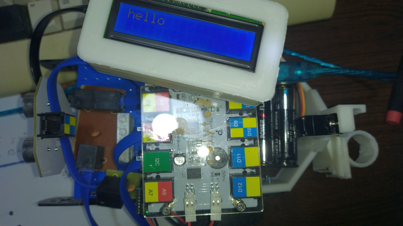
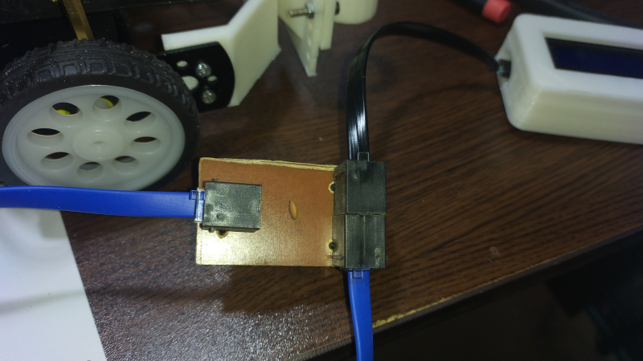
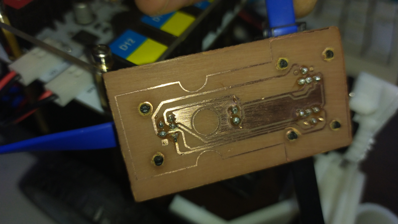
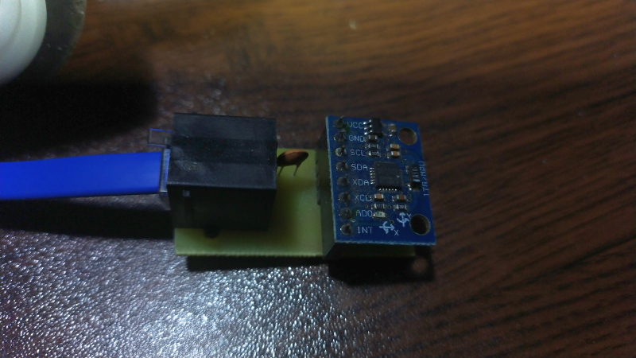
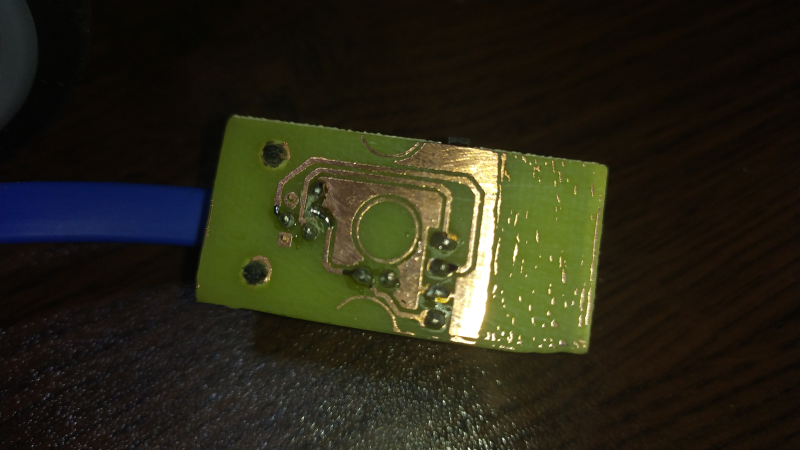
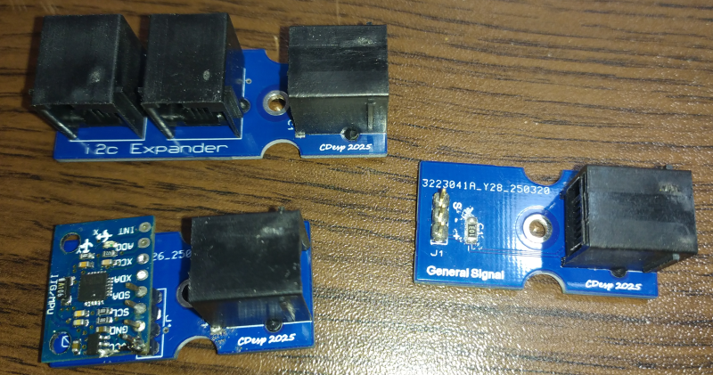
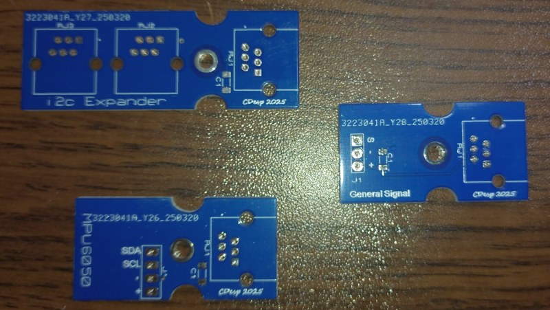
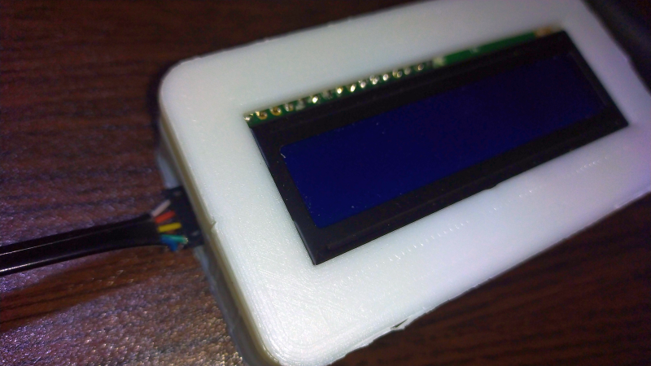
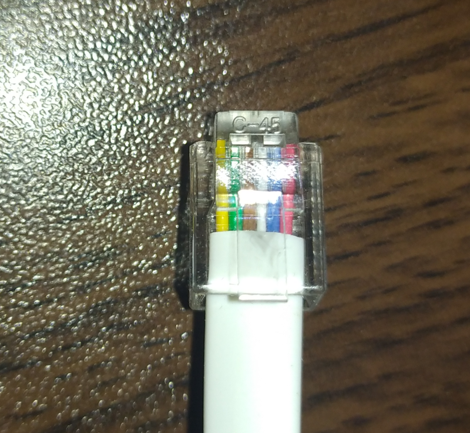

# R2 Extension

---------------------------------------------------------

## Summary

Mind+ extension for R2 robot by Polytech.

Supports text LCD 16x2 or 20x4 via I2C 

Supports arbitrary degrees turn utilizing a MPU6050 Accelerometer & Gyroscope via I2C

## Useful 3D designs

LCD case  https://www.thingiverse.com/thing:5249491/files  

### Pen Holder on the Right Side at the back of the R2 Car
 
Pen Holder https://www.thingiverse.com/thing:6964192  
Servo adaptor - Pen goes Left - Right https://www.thingiverse.com/thing:6958101

### Pen holder on the Center at the back of the R2 Car

Pen Holder https://www.thingiverse.com/thing:6964192  
Servo Adaptor - Pen goes Up-Down  https://www.thingiverse.com/thing:6977092

## Schematics for Small boards for the R2

### i2c Expander

This small board is usefull if you want to have 2 i2c devices.

### i2c MPU6050 Accelerometer & Gyroscope

This small board allows a GY521(MPU6050) to interface with the R2 via i2c

### My small production PCBs manufactured by JLCPCB (you can download the zip files on the schematics folders)

## i2c LCD Cable

Cable for the i2c LCD 16x2

 
You will need a cable like that

Yellow is 1 and Red is 6

The flat cable has 6 small cables that should be arranged like that:

From Left to right we will be using the following four small cables

6,4,2,3

GND,VCC,SDA,SCL for the i2c LCD parallel to serial adaptor

## VIDEO
https://youtu.be/83h1kVOISvc

## Release Logs
* V0.5  Added new commands forward, backward for specified seconds, some fixes
* V0.4  Added commands for motor control and Pen, some fixes on turning by degrees
* V0.3  Changed the MPU library, added new commands for motor control
* V0.2  Added support for arbitrary degrees turn
* V0.1  Basic functions completed.
