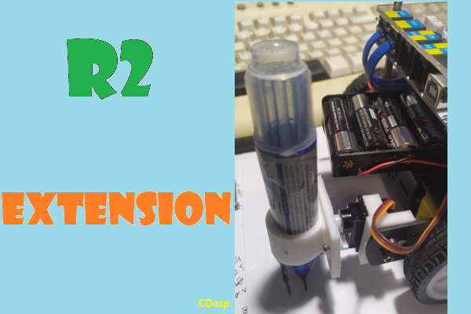

# R2 Extension

---------------------------------------------------------

## Summary

Mind+ extension for R2 robot by Polytech.
Supports text LCD 16x2 or 20x4 via I2C 
Supports arbitrary degrees turn utilizing a MPU6050 Accelerometer & Gyroscope via I2C

## Useful 3D designs

LCD case  https://www.thingiverse.com/thing:5249491/files  

### Pen Holder on the Right Side at the back of the R2 Car
 
Pen Holder https://www.thingiverse.com/thing:6964192  
Servo adaptor - Pen goes Left - Right https://www.thingiverse.com/thing:6958101

### Pen holder on the Center at the back of the R2 Car

Pen Holder https://www.thingiverse.com/thing:6964192  
Servo Adaptor - Pen goes Up-Down  https://www.thingiverse.com/thing:6977092

## VIDEO
https://youtu.be/83h1kVOISvc

## Release Logs
* V0.2  Added support for arbitrary degrees turn
* V0.1  Basic functions completed.
