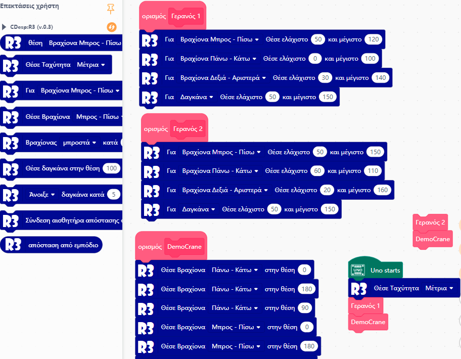

# R3 Extension

---------------------------------------------------------

## Summary
Mind+ extension for R3 Crane by Polytech.

Each Crane is setup differently so you must set the min and max of each one.
You always set the position in the range of 0-180 degrees, this gets translated automatically so each program gives the same result 
provided of course you set up the servos limits correctly.

## VIDEO

https://youtu.be/6Uv8e6iaV-k

## Release Logs
* V0.4  Added new commands to set the limits of each servo. Position is now always on the 0-180 range. You can read the current position.
* V0.3  Reorganize the command blocks
* V0.2  added support for speed, and for ultrasonic distance servo attached to pin 6 relocated to pin 8
* V0.1  Basic functions completed.